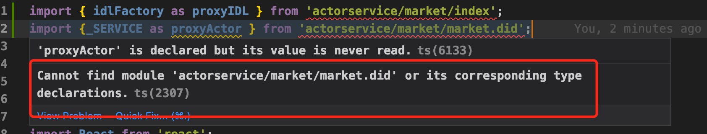

# NnsDao Backend Service

## Install

```sh
# Use default ssh account
npm i git+ssh://git@github.com:NnsDao/ActorService.git

# Or use another ssh account
npm i git+ssh://xxxx:NnsDao/ActorService.git
```

## Usage

```js
// import IDL
// import { idlFactory as proxyIDL } from 'actorservice/xxxx/index';
import { idlFactory as proxyIDL } from 'actorservice/market/index';

// import Service
// import {xxx as xxx } from 'actorservice/xxx/xxx.did'
import { _SERVICE as proxyActor } from 'actorservice/market/market.did';
```

## Typescript warning

If you got this warning



Config Path alias at `tsconfig.json`

```json
{
  "compilerOptions": {
    // xxx
    "paths": {
      // xxx
      "actorservice/*": ["node_modules/actorservice/src/*"]
    }
  }
}
```
